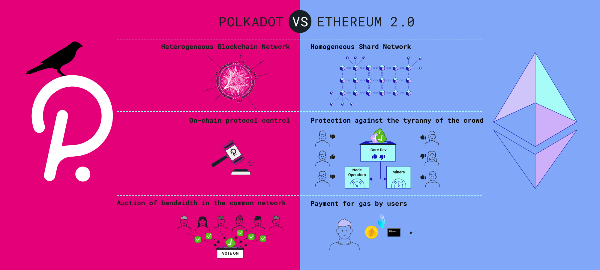

Создатели проекта работают над тем, чтобы обеспечить безопасную работу умных устройства для пользователей по всему миру с помощью децентрализованных приложений, которые не требуют передачи пользовательских данных для аутентификации. В научных исследованиях и статьях создатели Робономики представили различные концепции и решения, объединенные одной идеей - экономика роботов. Суть идеи в экономической системе, где робототехнические устройства выступают независимыми агентами, которые способны выполнять ключевую работу в различных сферах практически без участия человека. Если структура М2М (machine-to-machine) будет настроена должным образом, то экономика роботов может бесшовно стать продолжением экономики людей, значительно улучшая и ускоряя ее процессы. В то же время, при организации М2М-структуры возникают различные трудности. Так, например, владельцы компаний рискуют столкнуться со значительными издержками, при попытке организовать безопасный обмен техническими и экономическими данными с другими компаниями. В этой статье вы более подробно разберетесь в теме и поймете актуальность появления экономики роботов. 

 
Рональд Коуз в своей работе 1937 года [«The Nature of the Firm»](https://www.jstor.org/stable/2626876) утверждает, что сложная иерархия в компании создает больше внутренних издержек, из-за чего предприниматели ищут способы их сократить. Наглядное уменьшение таких издержек можно наблюдать в экономике совместного потребления, о которой в своей работе писал экономист М. Мангер. Одним из факторов того, что предприниматели начали искать способы уменьшить затраты на организацию бизнеса, стало активное развитие умных автоматизированных устройств. Таким образом, регулярные операции большинства бизнес-процессов крупных компаний стали полностью автоматизированы. Заглядывая в будущее, можно предположить, что это приведет к появлению и постепенному внедрению робофирм, в которых все процессы происходят автоматически и почти не требуют участия людей.

Для успешного внедрения робофирм нужно построить налаженную кибер-физическую систему (сокр. КФС) — прочное объединение и взаимную интеграцию множества вычислительных, сетевых и физических процессов. Это сложная структура из различных элементов: от приложения на смартфоне до управления дроном, а уже потом обработки облачным ИИ. Но что же самое важное в процессе создания КФС? Это найти баланс между достаточным и избыточным количеством автоматизированных элементов в цепочке обеспечения пользователя услугами. В поисках ответа на этот вопрос, обратимся к работе известного математика Норберта Винера [«Cybernetics: Or Control and Communication in the Animal and the Machine»](https://mitpress.mit.edu/books/cybernetics-or-control-and-communication-animal-and-machine-reissue-1961-second-edition). В книге он пишет о том, что на первый взгляд, абсолютно несвязанные теории могут помочь друг другу в решении задач. Именно его подход стал важной частью науки кибернетики и заложил теоретические основы для разных научных направлений — автоматической навигации, ИИ, нейробиологии, телекоммуникаций, аналоговых вычислений. Мы можем найти связь между учениями Н. Винера и Р .Коуза: обе работы рассматривают независимых агентов, которым нужно выполнять конкретные задачи с минимальными издержками и затратами на транзакции. Представим ситуацию, когда на рынок внедряются кибер-физические системы, в своем идеальном представлении — робофирме. Совокупность робофирм в таком случае формирует экономику роботов, которая наследует все признаки любой экономической системы. Таким образом, рост робофирм (и соответственно баланс между числом автоматизированных элементов) будет зависеть от самого рынка, формируя саморегулирующуюся систему. 

Но у этой системы будет важное отличие, от текущей экономической системы людей — скорость выполнения транзакций. За последние 70 лет механизм скорости принятия и обработки транзакций значительно упростился. Мобильные телефоны способны коммуницировать с автоматизированной банковской системой практически в любом месте и в любое время. Крупные компании также используют автоматизированные процессы в управлении бизнес-процессами. Уже сейчас автономные системы взаимодействуют с такими же финансовыми системами. Мы даем доступ роботам управлять нашими деньгами без нашего участия, чтобы упростить процессы и сделать жизнь человека лучше. Все это приведет к тому, что начнется построение более сложных автоматизированных цепочек, процессы в которых будут затрагивать обмен как технической информацией, так и экономической. 

Теперь пришло время поговорить о первых цифровых деньгах, которыми робот может распоряжаться автономно — криптовалюте. Возможно, именно криптовалюты  станут главным средством накопления денег робофирмами в обществе людей. Для их полноценного использования необходима более точная интеграция технических и экономических транзакций. Решение этой задачи впервые было предложено платформой [Ethereum](https://ethereum.org/en/whitepaper/). Она представила первую качественную реализацию концепции умных контрактов — компьютерных алгоритмов, способных описывать условия, триггеры и бизнес-логику для выполнения транзакций. У роботов появился не только доступ к деньгам, но и возможность заключать договоры с человеком и другой автоматической системой.

Даже при решении вышеописанных задач, перед Робономикой стоит еще одна проблема — высокая цена (от 10 до 100 долларов США) за запуск IoT-устройства с помощью умного контракта Ethereum. Чтобы снизить цену транзакции разработчики Робономики решили перейти на платформу [Polkadot](https://polkadot.network/PolkaDotPaper.pdf). Это протокол для построения гетерогенных мультичейн сетей. Он позволяет запускать собственные независимые блокчейны, для которых безопасность коммуникации обеспечивает более крупная сеть. Еще одним вариантом является сеть Kusama (экспериментальная сеть Polkadot для исследования и разработок). Она дает возможность разработчикам создавать парачейны и тестировать различные функции и валидации Polkadot в реальной среде.  Парачейн Робономики в сети Kusama или Polkadot позволит реализовать функции, которые недоступны разработчикам умных контрактов в Ethereum.

Последним вопросом остается целеполагание роботов при оказании услуг людям. Процесс работы между людьми включает в себя такие качества как добросовестность, честность и др., о которых сложно говорить в рамках темы экономики роботов. Но при подробном изучении самих процессов вы сможете узнать, какие рамки можно сформировать для построения налаженных процессов в робофирмах.

Подробнее о взаимодействии робота и человека вы узнаете на сайте Robonomics: https://robonomics.network/white-paper-2022/ 